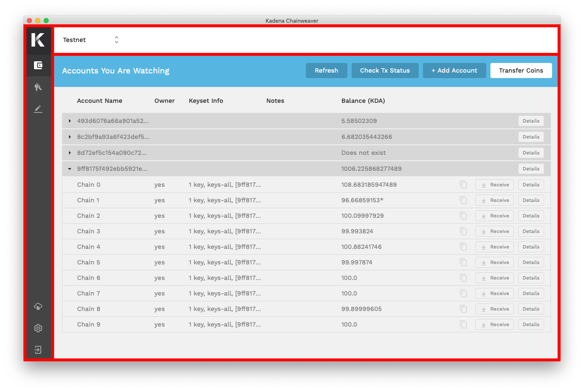
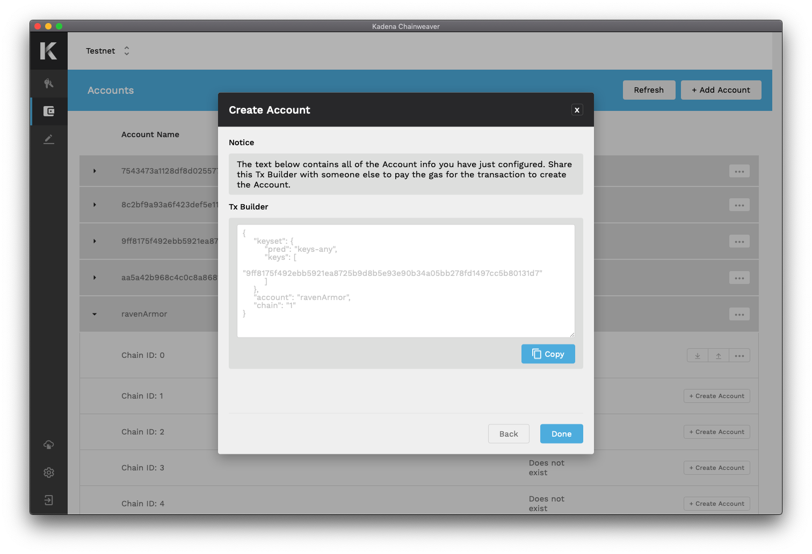

#User Guide

##**Getting Started**

###Installing the Chainweaver software

Chainweaver is available for download in three formats to accommodate users’ preference in operating system; (1) .dmg for Mac, (2) .deb for Linux, (3) and .ova for Windows, Linux, and Mac as a virtual appliance

####**.dmg for Mac**

*Compatible with macOS High Sierra 10.13 and above*

* Download the .dmg from <a href=“https://www.kadena.io/chainweaver" target="_blank">https://www.kadena.io/chainweaver</a>
* Navigate to your downloads folder, open the .dmg, and drag the application into your Applications folder.


####**.deb for Linux**

*Compatible with Ubuntu 18.04*

* Download the .deb from <a href=“https://www.kadena.io/chainweaver" target="_blank">https://www.kadena.io/chainweaver</a>.
* Navigate to your downloads folder and double click the .deb.


* Click the install button on the install window that pops up.


* There should be a progress bar that appears and progresses to completion until you see this installed state. Be sure to check that the installed version is the one that you tried to install.


* You can now find chainweaver in the applications menu.


* With this icon


!!! warning "Help"
      See the <a href="../troubleshoot" target="_blank">Troubleshoot Page</a> if you encountered issues installing the .deb

####**.ova for Windows, Linux, and Mac**

* First, make sure that you have [virtualbox](https://www.virtualbox.org/wiki/Downloads) installed as this virtualisation app is required to run the OVA.

* Download the .ova from <a href=“https://www.kadena.io/chainweaver" target="_blank">https://www.kadena.io/chainweaver</a>.

* Navigate to your downloads folder and double click the .ova.


* You should get an import virtual appliance dialog which you can safely accept the defaults and press import.


* Once this is imported, you can run the virtual machine by double clicking "Kadena Chainweaver VM" in the list of VMs.


* This will start the virtual machine and it will boot like a normal computer. Eventually you should see chainweaver like this.


!!! warning "Help"
      See the <a href="../docs/troubleshoot.md" target="_blank">Troubleshoot Page</a> if you encountered issues installing the .ova

### Create a new wallet or restore an existing wallet


**Create a new wallet**

There are three main steps to create a new wallet; (1) set password, (2) record recovery phrase, (3) verify recovery phrase

1. ​Set password: Create a strong, secret, and unique password. See the Basic Safety Tips section for suggestions on password generation.
2. Record recovery phrase: Mouse over each of the 12 words to view and record your recovery phrase. See the Basic Safety Tips section for suggestions on securing your recovery phrase.
3. Verify recovery phrase: Enter each word in the correct order to verify that you have correctly recorded your recovery phrase.

**Restore existing wallet**

There are three main steps to restore an existing wallet; (1) enter recovery phrase, (2) set new password, (3) re-generate keys

1. Enter recovery phrase: Follow the guidance to enter your 12-word recovery phrase.
2. Set new password: Input a new password for your existing wallet.
3. Re-generate keys: From the Keys section, select the Generate Key button to restore keys. These keys are deterministically generated meaning that the same keys will always appear in the same order by using the recovery phrase as a master seed. Repeat selecting the Generate Key button until all necessary keys are restored.

###Interface overview



​Chainweaver's interface consists of three main elements; (1) Network Display, (2) Sections Menu, (3) Main Viewer

**Network Display (top bar)**
This display bar persists across all screen views within Chainweaver so that you will always know the network with which you are interacting

**Sections Menu (left bar)**
Use this menu to go to different Sections

* Keys: Display of all public keys generated within the wallet
* Accounts: Display of all added accounts and their status across chains. Deposit and withdraw KDA.
* Contracts: Write, deploy and interact with smart contracts
* Resources: Reference helpful support materials
* Settings: Configure wallet and network settings
* Logout: Log out of the desktop application

**Main Viewer (center screen)**
This is where you interact with the section you have chosen from the Sections Menu.

###Update to the latest version of Chainweaver

Upgrading Chainweaver is an essential part of keeping your crypto assets safe and enjoying new features for interacting with the Kadena blockchain ecosystem. The latest version of Chainweaver will always be available for download at <a href=“https://www.kadena.io/chainweaver" target="_blank">https://www.kadena.io/chainweaver</a>.

​Note: Ensure you have a secure connection before downloading any applications. Most issues can be resolved simply by updating to the latest version of Chainweaver.

##**Networks**

###Different networks in Chainweaver

Chainweaver allows you to interact with different networks, including the main network (“Mainnet”) and a test network (“Testnet”)

* Mainnet is the primary live blockchain network where assets of value can be transferred and smart contract services can be called.
* Testnet is a network with which you can safely test various blockchain interactions without the risk of losing valuable assets.
* Both Mainnet and Testnet are fully operational, real blockchains. It is only Testnet, however, where you can acquire KDA coins for free from a <a href="https://faucet.testnet.chainweb.com/" target="_blank">coin faucet</a>. Naturally, account balances cannot move between networks.

###Change networks


You can change the network with which you are actively interacting by selecting the drop-down arrows beside the displayed network in the Network Display top bar.

Simply select the desired network from the available list and confirm the selection. The keys displayed in the wallet will persist across networks, while the accounts list will refresh to display those that you have added on the chosen network.

###Create a custom network


You can add your own custom network by selecting the appropriate option from the Settings section.
​
To create a new network, you will have to define a network name then enter the addresses for the nodes to which you would like the network to connect. Node status is displayed with a traffic light style indicator.

!!! Summary "Note"
      Custom networks are defined locally and will only be visible within the application that created it. It is recommended that a network connect to at least 3 nodes.

##**Keys and Accounts**

###Understanding Keys vs. Accounts

In brief, Keys sign transactions and Accounts may be governed by one or multiple keys.

With most blockchains, accounts are modeled as simply public/private keypairs. This one-to-one model keeps things simple, but runs into problems when account control requires a many-to-many model (such as with jointly owned or majority ruled accounts).

Kadena natively supports multiple keys governing the same account, and thus the distinction between Keys and Accounts becomes important.

Every Account is governed by a keyset which must be defined when creating any Account. Keysets are composed of two parts; (1) a set of keys and (2) a predicate

* Set of keys: a list of public keys that are associated to the account
* Predicate: a governance function that determines which keys are allowed to make choices for the account when it comes to transactions (e.g. do all keys need to be present? only one? two? etc.)

Summarily, keysets look like the following as JSON data:

```
{
  "keys": ["pubkey1", "pubkey2",...,"pubkeyN"],
  "pred": "some governance function"
}
```

When signing a transaction, the list of private keys supplied as signing key pairs will be checked against the keyset and predicate to ensure that not only are all keys that need to be present accounted for but that the predicate is satisfied.

###Generate a Key

The first step towards transacting on the Kadena blockchain is to generate a key pair.


Begin by selecting the “+ Generate Key” button, then continue to Accounts.

###Add an Account

Accounts are effectively equivalent to your identity on the blockchain. When you add an Account in Chainweaver, you will be able to view information about it such as its keyset info and balance on each of the known chains.


Select “+ Add Account” to view existing accounts or create a new account.

Optionally, you can add personal notes beside any account. This field is never seen by the blockchain, and only serves as a personal reference to organize a user’s wallet.

###Create an account

Begin by entering the desired account’s name within the “+ Add Account” dialog to see whether it already exists. If the account is available, you will see a “+ Create Account” button in the corresponding Chain ID row as well as an account balance of “Does not exist.”


Select the “+ Create Account” button beside the desired account’s Chain ID row to open the dialog. Fill in the required fields to define the account’s keyset.

Since adding any record to the blockchain necessitates a transaction, you too must submit a transaction in order to permanently claim the account’s name on the blockchain. As with all transactions, a nominal amount of gas must be paid in order to execute the transaction.

If some account in your wallet has funds on the same chain as the desired new account, you may select “I am the Gas Payer” to complete the transaction flow by paying for the gas yourself.

If you do not have any funds, you may select “I am not the Gas Payer” to view and copy the Tx Builder which contains all of the account info you have just configured. Share this Tx Builder data with someone else to pay the gas for the transaction to create the account for you.



Remember that the Kadena public blockchain network is comprised of many chains braided together. In effect, each chain is a standalone blockchain, therefore you will have to create your desired account on each chain for which you want it to exist. Naturally, the same account name will have a different account balance on each chain, and may also have different owners or a different keyset. Always be sure to take note of the chain on which you are transacting.

###Remove an account


To remove an account from view, begin by selecting the Details button in the desired account row to reveal Account Details.

Near the bottom of the Account Details dialog, select “Remove Account”

Read the warning message and confirm your selection by selecting “Remove Account”

##**Transactions**

Signing transactions in Chainweaver is different from most crypto wallets in two distinct ways; the concepts of (1) Tx Builder and (2) granting capabilities each provide the user with greater transparency and control.

**Tx Builder**

This is a JSON blob including the necessary information to build a transaction. For simple transfers it might include just an account name and chain ID, like this:

```
{
	"account": "alice",
	"chain": "5"
}
```

For account creation it might also include a keyset, like this:

```
{
	"account": "alice",
	"chain": "5",
	"keyset": {
		"keys": ["368698bf0354b0c04884a185a7eefd20500562cad23bf9c25eee53ddc0ba7d7b"],
		"pred": "keys-all"
	}
}
```

While users will never need to compose this code themselves, it is important to become familiar with reading it to understand how some blockchain operations work.

**Granting capabilities**

Performing transfers necessitates a call to the blockchain’s coin contract. This contract describes the rules for transferring coins and one such rule requires that the Sender account grant the capability to transfer coins in order for the transaction to be submitted. The act of granting capabilities is akin to authorizing or signing a transaction. In more advanced scenarios some contracts require multiple capabilities to be granted. This concept gives the user greater control and transparency to what they are signing.

###Receive Kadena (KDA)

To receive KDA, you must first share your Tx Builder with another person from whom you wish to receive a payment.

To access your Tx Builder, navigate to the Accounts section and select the “Receive” button beside the desired account’s chain ID row.


This will open the Receive dialog from which you can copy the Tx Builder and share with others.
​
One additional feature for experienced users is the ability to transfer KDA from compatible accounts that were not generated within Chainweaver. You can access this feature from the Receive dialog by expanding the menu-field under the sub-section “Option 2: Transfer from non-Chainweaver Account.” Fill in the required fields to Submit Transfer.

###Send Kadena (KDA)

Since the Kadena public blockchain network braids multiple chains together, you can transfer KDA in two ways; (1) transfer between the same chain and (2) transfer between different chains.

**Transfer between the same chain**

Navigate to the Account section and select the “Send” button beside the desired account’s chain ID row from which you would like to transfer funds.


This will open the Send dialog which is divided into two parts; Configuration and Sign:

Configure the transaction

* Recipient: Enter the recipient’s Tx Builder and amount to send
* Transaction Settings: Choose the transaction speed and expiration

Sign the transaction

* Gas Payer: Select an account to sign and pay the transaction gas


Once all required fields have been entered, select the “Preview” button. Here you will be able to review and confirm details before submitting the transaction.

**Transfer between different chains**

This process has one distinct difference from transfers on the same chain. This time when you sign the transaction, you must select two Gas Payers:

1. Gas payer on the originating chain to initiate the transfer
2. Gas payer on the destination chain to redeem the transfer


It may seem unusual to have to pay for gas twice, but consider what is happening with a cross-chain transfer. In this scenario you are moving coins between two different blockchains, each with their own ledger. Therefore gas on one chain cannot pay for executing operations on a different chain.

###Adjust gas price and gas limit


Before you submit any transaction or deploy any smart contract, you will have the opportunity to configure a few settings. You can adjust both the Gas Price and the Gas Limit of your transaction. As either of these settings are adjusted, you can see how these changes might affect Transaction Speed and Max Transaction Fee.

!!! Summary "Note"
      Chainweaver does not charge a fee to send or receive a transaction. All transaction fees go directly to miners as compensation for providing the compute power required to execute the operation.

###Track your transaction


Once a transaction has been submitted, Chainweaver will display the Transaction Status as it moves through progress states. The average block time in the Kadena network is 30 seconds. So depending on the Transaction Speed you assigned, it may take several blocks before your transaction is successfully mined.

* Transaction success: When the transaction has been successfully mined in a block, a Transaction Result will display.
* Transaction failure: If the transaction fails at any progress state then a red “X” will appear beside the failing state.

##Smart Contracts

The ability to write, deploy, and call smart contracts from within Chainweaver makes it one of the most comprehensive workbench tools for blockchain. Navigate to the Contracts section and utilize the integrated development environment (IDE) for developing and testing Pact smart contracts.

Pact is the safe and simple smart contract language used for interacting with the Kadena blockchain. Visit <a href="https://pactlang.org/" target="_blank">https://pactlang.org/</a> for developer tutorials covering key concepts and real projects you can deploy yourself.

###Deploy your own smart contract

Once you have written the code for your new smart contract in the code editor, check the ENV tab of the tool panel on the right side for any error messages that might be displayed. Once you are satisfied with your code, you can either select “Load into REPL” or “Deploy.”

* “Load into REPL” will execute the editor text within the local REPL environment so that you can test and interact with the contract
* “Deploy” will begin the process of configuring the smart contract for execution on the blockchain


Should you select “Deploy,” you will next be prompted to designate the transaction destination and settings. On the “Sign” tab you must enter any new capabilities as defined in your contract code, then select the account to authorize each capability.


Once all required fields have been entered, select the “Preview” button. Here you will be able to review and confirm details before submitting the transaction.

###Call an existing smart contract

Once a contract has been deployed, it will show up in the “Deployed Contracts” table under the “Module Explorer” tab of the Contracts tool panel. Contracts can be filtered by chain or through search.

Select “View” beside your chosen contract to reveal all of the available functions to call.

Select “Call” beside your chosen function to open a three-part dialog:

1. Parameters: enter the required parameters
2. Configuration: choose the transaction settings
3. Sign: grant the required capabilities

Preview the transaction, then select “Create Transaction” to execute the operation.

###Interact with Dapps

As a user, interacting with dapps is simple. Chainweaver takes advantage of a novel <a href="https://github.com/kadena-io/signing-api" target="_blank">wallet signing API</a> which facilitates communication between dapps and wallets.

First ensure your Chainweaver desktop application is open. When you’re ready to start some transaction with a dapp, initiate the request by submitting the required information (e.g. account name) to the dapp.

Once a call has been made, by pressing a button on the dapp interface or through some other means, the signing API will hit Chainweaver. When Chainweaver receives an API call, a new dialog will appear within Chainweaver displaying input data from the dapp.

Review the transaction details and complete the flow as you would for any other transaction; configure settings, grant capabilities, preview and create.

##Security and Access

###Key pair generation

Kadena uses Ed25519 public/private key pair signatures. Chainweaver can be used to easily generate compatible key pairs. Alternatively, you can generate key pairs yourself by following any kind of Ed25519 key generation method such as <a href="https://github.com/kadena-community/secure-keygen" target="_blank">this one</a> contributed to our community GitHub.

Learn more about Ed25519 <a href="https://ed25519.cr.yp.to/" target="_blank">here</a>).

###Basic safety tips

As with any valuable asset, it is important to establish a secure and reliable method for controlling who has access to it. While Chainweaver is designed to satisfy strict security standards, you are ultimately responsible for maintaining the security of your wallet’s access credentials—the password and recovery phrase.

**Passwords**: Consider using a password manager to generate a strong password with randomness of character types. If you decide to create a password yourself, make sure it is not the same or similar to any other password you have ever used.

**Recovery phrases**: This 12-word phrase is the master seed that generates all your wallet’s public/private key pairs. With this phrase, anyone can control your wallet, even from another device. Consider securing more than one copy to prevent a single point of failure from events like fires, loss, etc.

Kadena does not control any of your personal/private data on our servers. Never share passwords or recovery phrases with anyone, including the Kadena team. We will never ask for you to provide this. If someone claims that we do, insist on not sharing.

###Who can access your account

Anyone with your wallet's password, private keys or recovery phrase can access your account. Passwords, private keys, and recovery phrases are in the users’ hands and are the users’ responsibility. Chainweaver is simply an interface that allows you to more easily interact with your accounts and the Kadena blockchain.

###Lost password and/or recovery phrase

**Lost password**

If you lose your password, you can reset it by using your 12-word recovery phrase to restore the wallet with a new password.

**Lost both password and recovery phrase**

If you lose both your password and recovery phrase, you will permanently lose access to any accounts and their funds forever.

Kadena does not manage accounts with information such as passwords, private keys, or recovery phrases.  We only have access to the information that is publicly available on the blockchain. We do not have servers and we do not hold your assets.

###Log out

The “Log out” button in the lower-left of the Section menu will lock your wallet. A locked wallet cannot sign transactions or receive signing API calls.

##Codebase

To find out about the latest improvements to Chainweaver, view all activity available at the open-source repository on GitHub <a href=“https://www.kadena.io/chainweaver" target="_blank">here</a>.

##Contact

###Authorized Communications

Kadena staff will never ask for sensitive information, including passwords, recovery phrases or private keys.

Beware of fake accounts and scam attempts.

Chainweaver will only communicate through verified channels.

###Chat

Join our Discord server <a href="https://discord.io/kadena" target="_blank">here</a> and chat live with Kadena developers and the community on the #chainweaver channel
