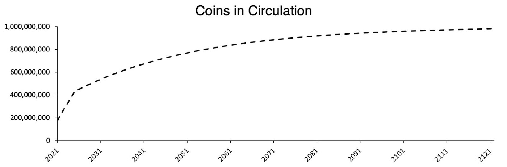
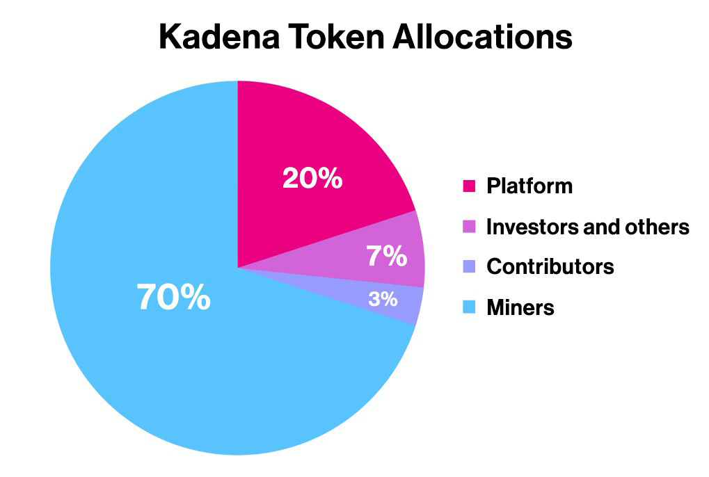

# What is KDA?

#### What does the KDA token do?

KDA is a digital currency that is used to pay for compute on the Kadena public chain. Similar to ETH on Ethereum, KDA on Kadena is the manner by which miners are compensated for mining blocks on the network and is the transaction fee that users pay in order to have their transactions included in a block.

 
#### What is Kadena’s token economic model?

Kadena’s Token Economic Model describes the total supply, liquidity schedule, allocation and platform reserve uses of KDA. A full text of Kadena’s Token Economic Model is <a href="https://medium.com/kadena-io/the-kadena-token-economic-model-8090d7545eef" target="_blank">here</a>.

 
#### What is the total token supply?

The total supply is fixed at 1 billion tokens to be mined over 120 years

 
#### What is the total number of tokens in circulation?

See <a href="https://medium.com/kadena-io/the-kadena-token-economic-model-8090d7545eef" target="_blank">Token Economic Model</a> for more detailed information

 
#### How is the total token supply allocated?

See <a href="https://medium.com/kadena-io/the-kadena-token-economic-model-8090d7545eef" target="_blank">Token Economic Model</a> for more detailed information

 
#### How do I get KDA?

Resources and guides for securing, managing and moving KDA are available <a href="https://www.kadena.io/getkda" target="_blank">here</a>.
